# 计算机基础
## HTTP简介
>HTTP（Hyper Text Transfer Protocol）协议即超文本传输协议，是从万维网服务器传输超文本到客户端（即本地浏览器或其他客户端）的传送协议。
>HTTP时基于TCP/IP来传输数据（html/图片/查询结果等）

### HTTP工作原理
HTTP是基于客户端/服务器（请求/响应）的协议。客户端通过url（Uniform Resource Identifiers）向web服务器发送HTTP请求，服务器接收到请求之后，向客户端发送HTTP响应。
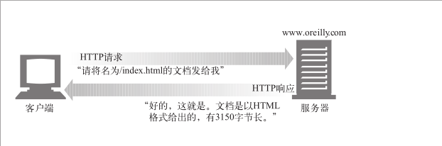
*web服务器：Apache服务器，IIS服务器（Internet Information Services）等*
*HTTP默认端口号为80，也可以改为8080或者其他*

### HTTP注意事项
- HTTP是无连接的：每次连接处理一个请求，服务器处理完客户的请求，并收到客户的应答后，即断开连接。采用这种方式可以节省传输时间。
- HTTP是媒体独立的：只要是客户端和服务器知道如何处理的数据内容，任何类型的数据都可以通过HTTP发送。客户端以及服务器指定使用适合的MIME-type内容类型。 
- HTTP是无状态的：无状态协议，无状态是指协议对于事务处理没有记忆能力。缺少状态意味着如果后续处理需要前面的信息，则它必须重传，这样可能导致每次连接传送的数据量增大。另一方面，在服务器不需要先前信息时它的应答就较快。

### HTTP消息结构
HTTP使用统一资源标识符即url来传输数据和建立连接。
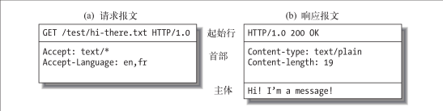
**客户端请求报文格式**
request信息组成部分：请求行，请求头部，空行，请求数据
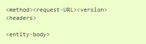
**服务器响应报文格式**
response信息组成部分：状态行，消息报头，空行，响应正文
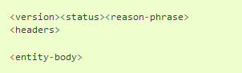
___
## TCP/IP（因特网传输协议）
TCP（Transmission Control Protocol）即传输控制协议。
IP（Internet Protocol）即网际协议。
TCP提供了：
- 无差错的数据传输
- 按序传输（数据总是会按照发送的顺序到达）
- 未分段的数据流（可以在任意时刻以任意尺寸将数据发送出去）

**HTTP网络协议栈图示**

**HTTP和HTTPS网络协议栈图示**
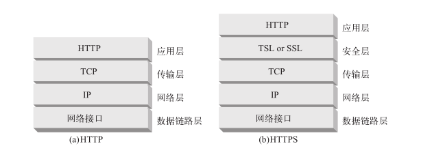
**url展现形式**

- IP地址+端口号：`http://207.200.83.29:80/index.html`
- 域名（主机名）`http://www.netscape.com:80/index.html`
域名服务（Domain Name Service，DNS），可将主机名转换为IP地址。

**基本浏览器连接处理示意图**
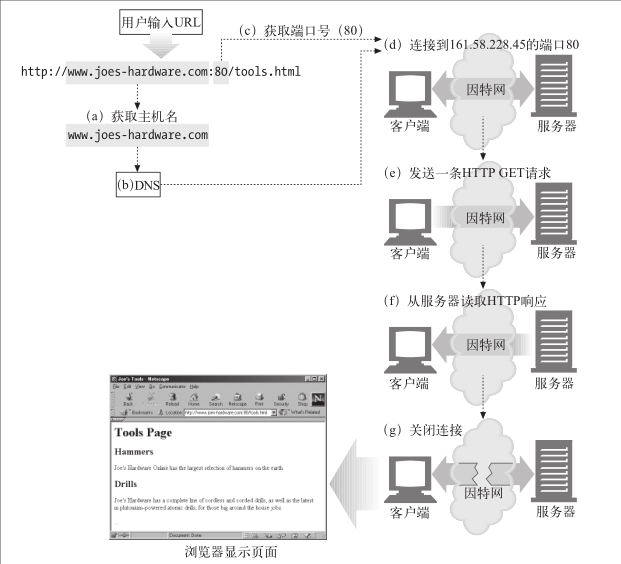

- 浏览器从 URL 中解析出服务器的主机名；
- 浏览器将服务器的主机名转换成服务器的 IP 地址；
- 浏览器将端口号（如果有的话）从 URL 中解析出来；
- 浏览器建立一条与 Web 服务器的 TCP 连接；
- 浏览器向服务器发送一条 HTTP 请求报文；
- 服务器向浏览器回送一条 HTTP 响应报文；
- 关闭连接，浏览器显示文档。

___
## web的结构组件
- 代理：位于客户端和服务器之间的 HTTP 中间实体
- 缓存（cache）：HTTP 的仓库，使常用页面的副本可以保存在离客户端更近的地方
- 网关（gateway）：连接其他应用程序的特殊 Web 服务器
- 隧道（tunnel）：对 HTTP 通信报文进行盲转发的特殊代理
- Agent代理：发起自动 HTTP 请求的半智能 Web 客户端

___
## HTTP请求
**HTTP1.0请求方法**
- GET：请求指定页面信息，并返回实体主体
- POST：类似GET，返回的响应无具体内容，用于消息报头
- HEAD：向指定资源提交数据进行处理请求（例如提交表单或者上传文件）。数据被包含在请求体中。POST请求可能会导致新的资源的建立和/或已有资源的修改。

**HTTP1.1新增方法**
- PUT：从客户端向服务器传送的数据取代指定的文档的内容
- DELETE：请求服务器删除指定的页面
- OPTIONS：允许客户端查看服务器的性能
- TRACE：回显服务器收到的请求，主要用于测试或诊断
- CONNECT：HTTP/1.1协议中预留给能够将连接改为管道方式的代理服务器

___
## HTTP响应
**HTTP状态码**
常用状态码
- 200 - 请求成功
- 301 - 资源（网页等）被永久转移到其他url
- 404 - 请求资源（网页等）不存在
- 500 - 内部服务器错误
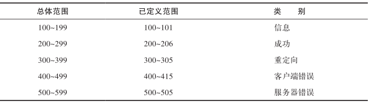
**1\*\*（消息）**
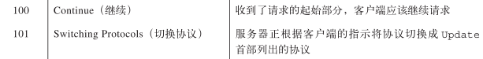
**2\*\*（成功）**
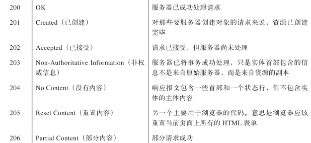
**3\*\*（重定向）**
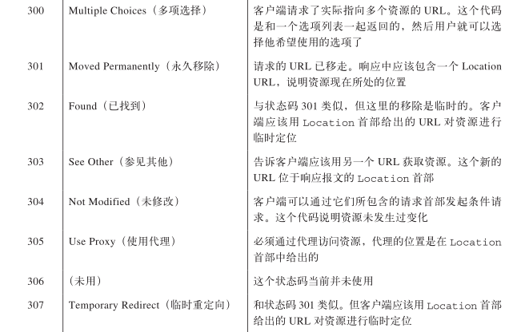
**4\*\*（客户端错误）**
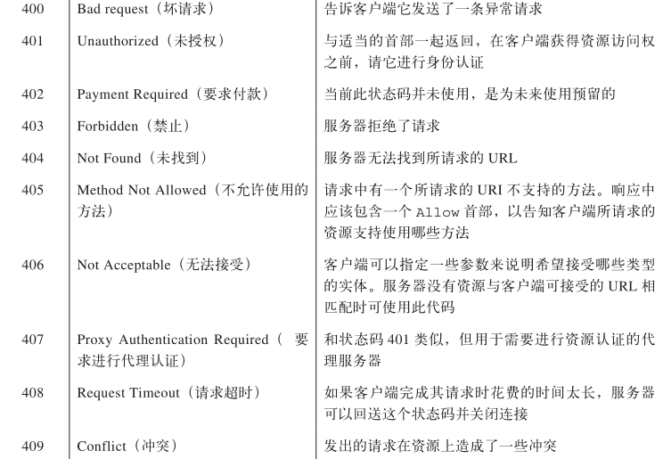
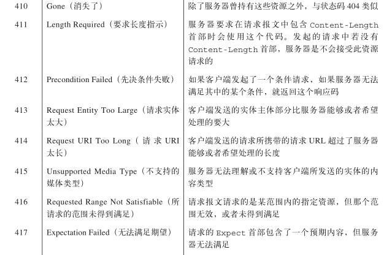
**5\*\*（服务器错误）**
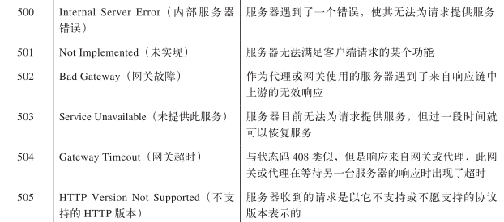

___
## 三次握手&四次握手问题

