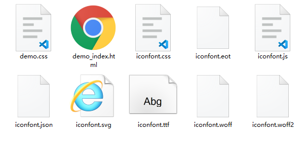

# font-icon引用

## Unicode引用
```hrml
//html标签之间包裹Unicode编码
<span class="icon">&#x33;</span>
```
```css
//拷贝项目下面生成的@font-face
@font-face {
  font-family: 'iconfont';
  src: url('iconfont.eot');
  src: url('iconfont.eot?#iefix') format('embedded-opentype'),
      url('iconfont.woff2') format('woff2'),
      url('iconfont.woff') format('woff'),
      url('iconfont.ttf') format('truetype'),
      url('iconfont.svg#iconfont') format('svg');
}
//定义使用图标的样式
.icon {
  font-family: "iconfont" !important;
  font-size: 16px;
  font-style: normal;
  -webkit-font-smoothing: antialiased;
  -moz-osx-font-smoothing: grayscale;
}
```
**特点**
- 兼容性最好，支持IE6+，及所有现代浏览器
- 支持font-size和font-color属性改变样式
- 本质还是字体，不支持多色，仅仅是单色图标

## Font class引用
```html
//首先引入iconfont.css文件
<link rel="stylesheet" href="./iconfont.css">
//挑选相应图标并获取类名
<span class="iconfont icon-xxx"></span>
```
**特点**
- 兼容性最好，支持IE8+，及所有现代浏览器
- 支持font-size和font-color属性改变样式
- 相比于Unicode语义明确，书写更加直观
- 使用class属性定义图标，图标更换更为方便
- 本质还是字体，不支持多色，仅仅是单色图标

## Symbol引用
```html
//首先引入iconfont.js文件
<script src="./iconfont.js"></script>
//挑选相应图标并获取类名
<svg class="icon" aria-hidden="true">
  <use xlink:href="#icon-xxx"></use>
</svg>
```
```css
//加入通用的css代码
.icon {
  width: 1em;
  height: 1em;
  vertical-align: -0.15em;
  fill: currentColor;
  overflow: hidden;
}
```
**特点**
- 兼容性较差，支持IE9+，及所有现代浏览器
- 支持font-size和font-color属性改变样式
- 支持多色图标，不再受单色限制
- 浏览器渲染SVG的性能一般，还不如png