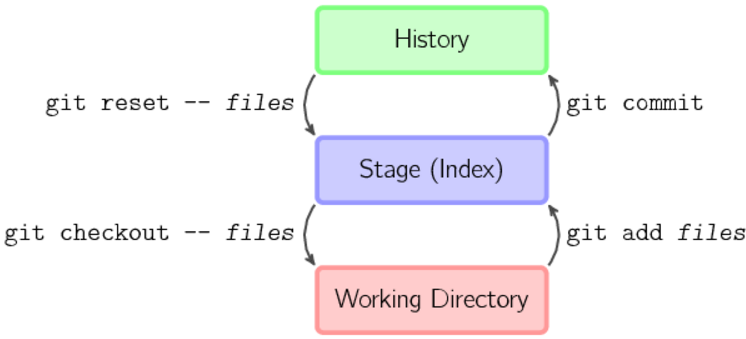
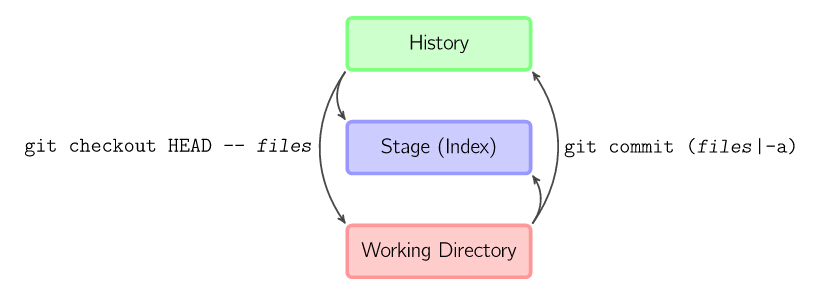
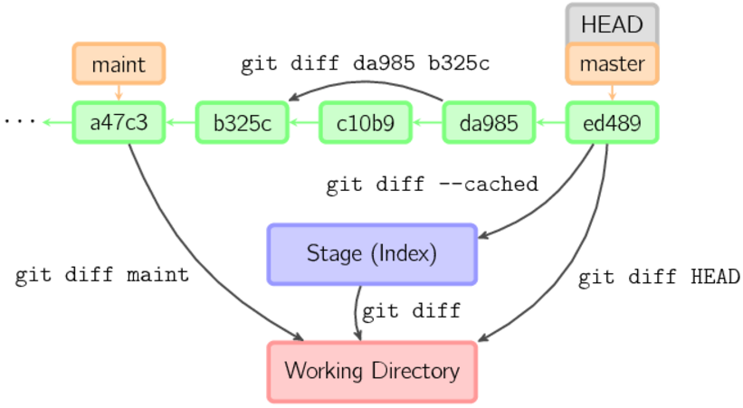
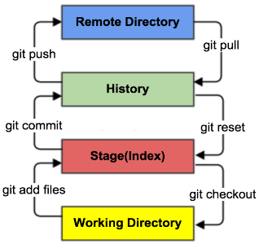

# Git使用指南
## git 安装&初始化配置
git官网下载地址：<https://git-scm.com/>
### 全局配置& ssh key
本地配置用户名和邮箱
	git config --global [user.name] "你的用户名"
	git config --global [user.email] "你的邮箱"
生成ssh key: `ssh-keygen -t rsa -C "你的邮箱"`
复制ssh key: `clip < ~/.ssh/id_rsa.pub`
将ssh key添加到github setting里的SSH and GPG keys

测试是否添加成功: `ssh -T git@github.com`
### 查看&删除配置
查看配置: `git config --list`或`git config -l`
查看local配置: `git config --local  --list`
查看global配置: `git config --global  --list`
查看system配置: `git config --system --list`
删除local配置 : `git config --local --unset section.key`
删除global配置 : `git config --global --unset section.key`
删除system配置 : `git config --system --unset section.key`

___
## git本地仓库操作
**本地仓库常规流程示意图**

**本地仓库其他流程示意图**

### 文件查看&添加&提交
初始化办本地仓库: `git init [project-name]`
查看全部文件状态: `git status`
查看指定文件状态: `git status [file-name]`

添加全部新文件至暂存区: `git add .`或`git -A`
添加指定新文件至暂存区: `git add file-name`
提交暂存区文件至仓库: `git commit -m "提交信息"`
提交指定暂存区文件至仓库: `git commit file-name -m "提交信息"`
查看提交记录: `git log`

### 文件修改&删除
**本地仓库diff流程示意图**

查看工作区产生的修改: `git diff`
*注：工作区和暂存区文件差异*
查看工作区产生的修改: `git diff --cached`
*注：暂存区和仓库中文件差异*
查看工作区产生的修改: `git diff HEAD~n`
*注：工作区和仓库中文件差异*
撤销工作区产生的所有修改: `git checkout --.`
撤销工作区指定文件的修改: `git checkout --file-name`
`git checkout HEAD .`
`git checkout HEAD file-name`
撤销提交： `git commit --amend`
删除指定暂存区&工作区文件：`git rm file-name`
暂存区删除文件但工作区不变：`git rm --cached file-name`

### 版本回退
查看提交的版本号: `git reflog`
回退至某一版本: `git reset --hard 版本号` 
回退至上一个版本: `git reset  –hard HEAD^`
*注：有多少^，表示回退至前第多少个版本*
回退至前第n个版本: `git reset  –hard HEAD~n`
`git reset HEAD`
___
## git本地&远程仓库关联
**本地&远程工作关联示意图**

### 先本地仓库，后远程仓库
- 初始化本地仓库: `git init [project-name]`
*注：[project-name]表示新建一个文件夹为本地仓库*
- 在github新建(同名)的空仓库或者选取已有远程仓库
- 复制远程仓库地址url（http/ssh）
- 本地仓库关联远程: `git remote add origin [url]` 
- 从远程仓库pull文件: `git pull origin master`
（若远程仓库为空仓库则跳过该步骤）
- 本地仓库上传远程: `git push origin master`
（若首次上传远程使用: `git push -u origin master`）
- 远程仓库关联完成，后续直接进行add-commit-push操作
### 先远程仓库，后本地仓库
复制远程仓库地址url（http/ssh）
- 克隆仓库到本地: `git clone [url]`
- 无需关联，后续直接进行add-commit-push操作
*注：若是需要克隆&修改其他人的远程仓库，需先fork后clone再执行add-commit-push操作*
### 远程仓库相关操作

查看远程库信息 : `git remote`
查看远程库详细信息/地址 : `git remote -v`
查看指定远程仓库信息： `git remote show [url]`
下载远程仓库所有变动：`git fetch [url]`
新增一个远程仓库并命名：`git remote add name [url]`
取回远程变化并与本地合并：`git pull [url] [branch]`

___
## git分支创建&合并等操作
查看本地所有分支：`git branch`
查看远程所有分支：`git branch -r`
查看所有所有分支：`git branch -a`
创建分支：`git branch name`
切换分支：`git checkout name`
创建+切换分支：`git checkout –b name`
合并分支：`git merge name`
查看分支合并图：`git log --graph`
删除分支：`git branch –d name`
*注：-D表示强制删除分支*

___
## bash基础命令
创建文件夹： `mkdir`
删除某一文件夹： `rm -r dir-name`
新建一个文件：`touch file-name`
删除某一文件： `rm file-name`
显示当前目录路径： `pwd`
查看某文件内容： `cat file-name`
帮助： `help`
退出： `exit`
清屏： `clear`
查看命令历史：`history`