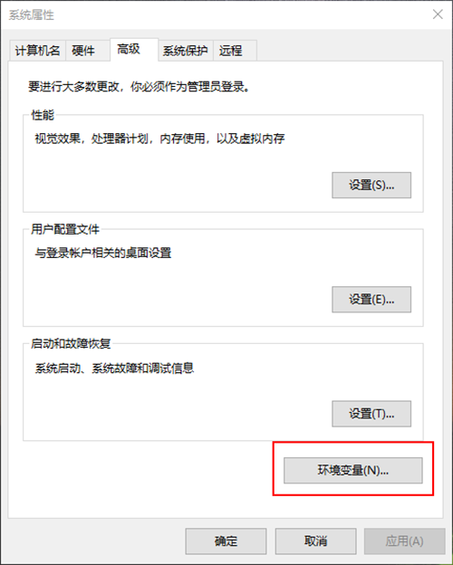
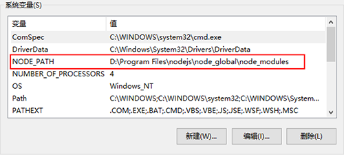
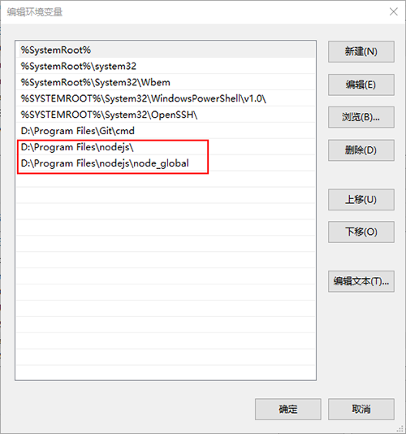
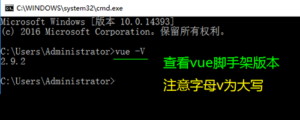
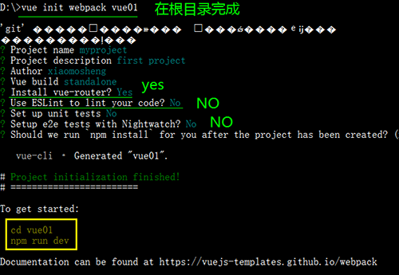
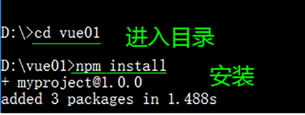
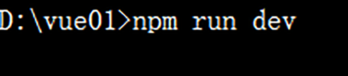
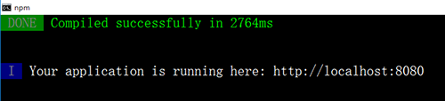
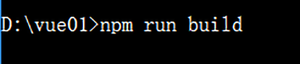
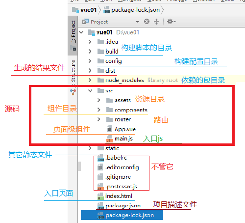

# nodejs笔记
## npm安装设置
### npm设置

1. 打开cmd控制面板
    win+R =>  cmd => 进入cmd控制面板

2. 改变默认安装配置路径
    //设置全局安装地址，npm install XXX -g 安装的文件保存在这里
    `npm config set prefix "D:\Program Files\nodejs\node_global"`
    //设置文件缓存地址
    `npm config set cache "D:\Program Files\nodejs\node_cache"`

3. 设置镜像文件
    //配置taobao镜像地址，提高下载速度
    `npm config set registry=http://registry.npm.taobao.org`
    //或者安装cnpm（china npm）
    `npm install -g cnpm --registry=https://registry.npm.taobao.org`
    
5. 设置环境变量
    此电脑 => 属性 => 最高系统设置 => 进入环境变量 
    
    在系统变量中新建NODE_PATH 内容是：D:\Program Files\nodejs\node_global
    
    在系统变量path编辑中添加以下两项内容
    

### npm命令
[npm安装文档](http://caibaojian.com/npm/)

```js
//package安装至全局
npm install -g XXX 
//package安装至本地
npm install XXX 
//package安装至本地（上线）
npm install --save XXX
//package安装至本地（开发）
npm install --save-dev XXX

//卸载package（代码模块）
npm uninstall XXX
npm uninstall -g XXX

//更新package（代码模块）
//package全部更新
npm update -g. 
npm update XXX 
npm update -g XXX 
```

## vue项目初始化
- 检查vue-cli是否安装成功

- 进入新建vue项目的盘符

- `vue init webpack vue01`，初始化vue项目

- cd进入vue项目，`npm install`安装依赖

- `npm run dev`，运行vue项目

- 成功界面，提示打开地址http://localhost:8080
 快捷键ctrl+c，终止批处理操作吗(Y/N)

- `npm run build`，生成静态文件，打开dist文件夹下新生成的index.html文件

- nmp下新建出来的vue01的目录描述
